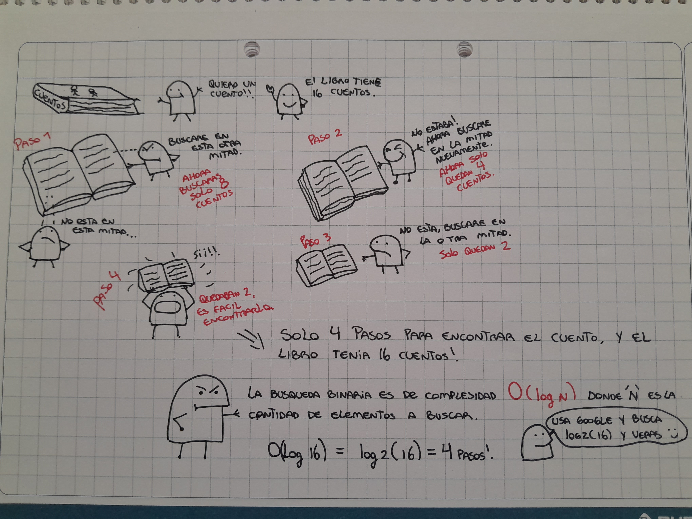

### Binary Search

El problema

Imagina que estas buscando a una persona en una agenda. Su nombre parte con K asi que inteligentemente partes buscando desde la mitad de la agenda y no te preocupas de buscar desde la letra A, luego la B, luego la C etc. 
En este concepto se basa la busqueda binaria :)

Por ejemplo, quieres adivinar un numero de entre una gran lista de numeros. Tu eleccion es 50 pero el numero que debes adivinar es el 80 por lo tanto si el numero buscado es mayor a tu numero eliminamos todos los numeros que son menores a 50 inclusive, asi en el proximo intento tendras menos numeros que buscar.

